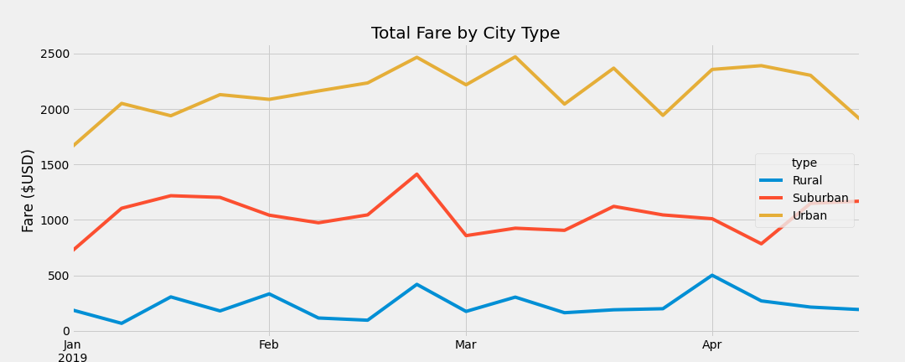

# PyBer_Analysis

## Overview 
For our fifth data analysis project, we are using data provided to us to analyze ride sharing information for PyBer.  We have expanded the tools available to us to include Matplotlib, which allows us to plot graphs directly in Juypter Notbooks.  We've learned how to manually annotate and adjust the graphs and finally how to use style sheets to change the appearance of the graphs.  Using the data provided, we were able to come up with a summary dataframe which compares the total fares by week for the three types of cities (Rural, Suburban, and Urban), and have been asked to graph the data using a line graph and a pre-chosen stylesheet and using the graph determine what we can draw from the results.

## Resources
- Data Sources: 
    - city_data.csv
    - ride_data.csv
                                
- Software: Python 3.9.7, Visual Studio Code, 1.63.2, Pandas 1.3.5, Jupyter Notebook 6.4.7, Matplotlib 3.5.1, 

## Pyber Analysis Results

Looking at the results below, we see that the largest revenue based on area type comes from Urban areas, which account for $39,854.38, or 62.7% of the total revenue.  Looking at the graph we produced, we can see that this remains pretty consistent during the observed months in 2019.

 

However, in digging into the data a bit more, we also see that Rural areas actually have the highest average fares per ride, being 41% higher than in Urban areas.  Indicating that people are taking longer rides to get out to these areas or just to get around.  As well, the Rural areas have a much higher average fare per driver $55.49, which is over three times as high is in Urban areas, at $16.57/driver.  Also, for Rural areas the average fare per driver is higher than the average fare per ride, but for Urban areas, the average fare per driver is less than the average fare per ride.  Indicating a possible shortage of drivers in rural areas and too many drivers in urban areas.  In urban areas, some drivers may even be sitting idle not taking rides at times.

 

## Pyber Summary

After analyzing the results, here are a few recommendations.  First, it seems that the driver availablility in rural vs urban areas is vastly different.  It may help to give drivers incentive for moving out to the rural areas.  since the revenue per driver is so low in urban so much higher in rural areas, this could ease competition for rides where there are too many drivers and provide drivers in areas where this is a potential shortage.  Second, potentially increase marketing in rural areas.  Since there is a higher profit margin in those areas, it may make sense to try to increase the number of rides requested in these areas.  Last recommendation may be to add a short distance fee to the rides in urban areas.  It seems that rides are much shorter, competition is higher, and there is a high volume of rides.  Adding this fee may help to increase the average fare and boost revenue because of the number of rides and potentially short rides.  